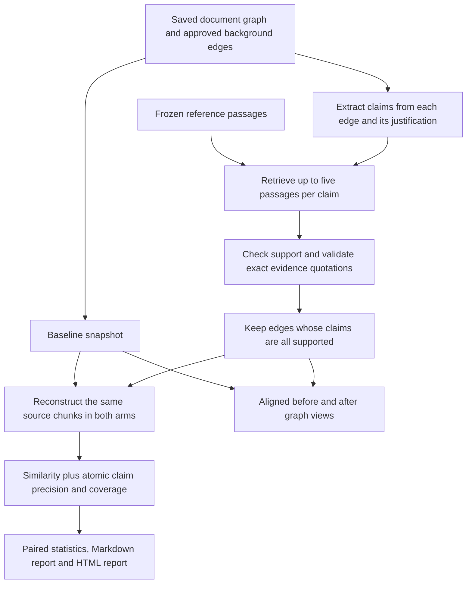

# Compare the baseline graph with FActScore evidence filtering

[Project overview](project-overview.md) · [Run commands](../README.md)

For one dashboard with side-by-side graphs, individual reports, and statistics,
use `run_pipeline_beforevsafter.py`. The
[before/after viewing guide](beforevsafter.md) gives the exact commands for
opening saved results and generating a full comparison.

This comparison keeps the existing extraction, candidate generation, critic,
usefulness scores, and reconstruction prompt. It adds an evidence check to
background edges and evaluates both reconstructions using atomic claims.
Results can improve, worsen, or stay unchanged. The generated report describes
the measured outcome; it does not assume an improvement.

The implementation adapts the method in
[FActScore: Fine-grained Atomic Evaluation of Factual Precision in Long Form Text Generation](https://arxiv.org/pdf/2305.14251)
(Min et al., EMNLP 2023). It uses local Ollama models and BM25 passage retrieval.
It is not the authors' released estimator or a reproduction of their benchmark.
Original-claim coverage and the evidence-based background acceptance rule are
project extensions.

The [first live pilot results](factscore-pilot-results.md) record the initial
two-chunk experiment, including its numerical results and observed verifier
limitations.

## Run a comparison

Start Ollama with the models used in the saved run installed. Saved comparisons
do not require Neo4j or Docker and do not alter the live database.

Find a completed full run:

```powershell
& .\.venv\Scripts\python.exe .\run_pipeline.py --list-runs
```

Try a small pilot first. Replace the run ID with one from the list:

```powershell
& .\.venv\Scripts\python.exe .\run_pipeline.py --compare-factscore run_20260914_174040_72ef4ce6 --factscore-limit 2 --factscore-edge-limit 2
```

This checks two chunks and at most two eligible background edges. Without a
reference argument, background evidence comes from the full input document.
The report labels this a pilot and a source-support experiment. It cannot
establish improvements on the full graph or independently verify external facts.
Pilot edge selection happens before verification, using the existing usefulness
score. Chunk selection follows the saved document evaluation order. Zero limits
(the defaults) mean all chunks and all original approved edges.

For a complete comparison against a separate reference collection:

```powershell
& .\.venv\Scripts\python.exe .\run_pipeline.py --compare-factscore run_20260914_174040_72ef4ce6 --factscore-reference .\data\references.json
```

To generate a new baseline and then compare it:

```powershell
& .\.venv\Scripts\python.exe .\run_pipeline.py --new --start-neo4j --factscore --factscore-reference .\data\references.json
```

Add `--factscore-verifier MODEL_NAME` to use a different installed Ollama model
for claim extraction and verification. The default is the baseline's generation
model. The saved generation and embedding model names are reused for both arms;
their current model digests are recorded when available.

`--dry-run` validates inputs and previews the comparison without model calls or
writes. `--no-open` saves the pages without opening a browser. The usual command
without FActScore flags continues to run the baseline pipeline.

## Prepare reference evidence

Create `data/references.json` with real, attributed passages you want to use as
evidence. Each item must have a unique ID and nonempty text. Supply short passages
instead of whole books; this implementation does not ingest PDFs or automatically
split large references. This is the required shape, with placeholder content:

```json
{
  "passages": [
    {
      "id": "reference-001",
      "source": "Reference title, edition, page or source URL",
      "text": "Replace this with an actual reference passage."
    }
  ]
}
```

The project's `{"chunks": [{"chunk_id": "...", "text": "..."}]}` format is
also accepted. A `source` string can carry attribution; URLs are recorded as
metadata and are not fetched. The supplied passages are copied into the experiment
and hashed. No reference collection is bundled or silently assumed trustworthy.

With no separate reference file, the original input is the evidence collection.
An unsupported background claim can be true but absent from that collection.
Even with external evidence, a model's support decision is not a guarantee of truth.

## What the experiment compares



The baseline is a **controlled replay** from saved artifacts. It is not a rerun of
extraction, and its scores need not equal historical `with_background.json`.
Historical evaluation reads a shared Neo4j graph, whose concepts and background
edges may have changed between runs. The comparison instead reuses the saved
`document.json` concepts, predicate, anchors, unit kind, selected relation hints,
and threshold, then retrieves background exclusively from the frozen baseline.
This fixes document hints across both arms even if the original database was shared.

The existing background reconstruction policy is preserved: only `IS_A`,
`HAS_PART`, and `REQUIRES_UNDERSTANDING_OF` supply reconstruction hints; at most
three edges per source concept and eight total hints are used. Scores still rank
those hints. Other approved relation types remain visible in graph snapshots
and undergo evidence filtering, although they do not supply reconstruction hints.
Ordering ties are resolved deterministically. Duplicate directed edges follow
the loader's last-row-wins behavior for reconstruction.

Every edge's relationship is checked explicitly, even when its justification
omits that assertion. The justification is also split into atomic claims.
An edge survives only if all claims are supported. Contradicted and unresolved
claims are retained in the audit but excluded from the after graph. Checker
failures are recorded as errors, never counted as false claims or approved.
Prerequisite relationships may be difficult to establish from ordinary reference
text; the method deliberately does not treat topical relevance as proof.

The first implementation filters existing approved candidates. It does not yet
generate new candidates from retrieved passages, correct rejected edges, change
the extraction schema, or calculate background recall against a gold graph.

## Read the results

Each experiment receives a new folder under:

```text
outputs/runs/<run-id>/factscore/<comparison-id>/
  report.html                  Statistical report, charts and claim audit
  report.md                    Shareable experiment document
  comparison.json              Full numerical results
  graph_comparison.html        Aligned, interactive before/after graphs
  manifest.json                Models, settings, hashes, status and errors
  references.json              Frozen evidence with attribution
  background_checks.json       Every edge's claim decisions and citations
  model_cache.json              Successful model responses
  source_document.json         Historical document evaluation hints
  source_background_approved.json
  source_manifest.json
  baseline/                    Baseline graph artifacts and reconstruction
  factscore/                   Filtered graph artifacts and reconstruction
```

Each arm includes `knowledge_graph.html`, `graph.json`, `fidelity.json`, and
`fidelity.html`. The source run's graph, reports, and JSON remain intact. Its
Pipeline results page gains links to the experiment. Both graphs are file-based
snapshots; viewing them requires neither Ollama nor Neo4j.

In the comparison view, both graphs share positions, search, pan, zoom, and node
dragging. Red dashed edges on the left were removed. Green edges were retained.
Outline nodes on the right show where background-only nodes disappeared. Select
an edge for its claims, retrieved evidence IDs, exact quotations, and decisions.
Use the report to look up reference attribution and full claim audits. Search
focuses both panels on the same concept neighborhood; Show all reveals both graphs.

| Metric | Question | Interpretation |
| --- | --- | --- |
| Supported reconstruction claims | What fraction of generated claims does the original chunk support? | FActScore-style source precision |
| Original claim coverage | What fraction of original claims does the reconstruction preserve? | Separate coverage extension |
| Claim precision/coverage F1 | Are precision and coverage both high? | Harmonic mean; does not replace inspecting each component |
| Embedding similarity | Does the reconstruction resemble the original semantically? | Existing metric; not factual accuracy |
| Lexical similarity | Does the reconstruction use similar words? | Existing average of Jaccard and BOW cosine |
| Background supported claims | How many checked background claims have reference support? | Descriptive selection diagnostic |

Original claims are extracted once per chunk and shared between arms. Identical
generation prompts reuse cached outputs so an unchanged graph hint set cannot
create a spurious difference through another generation call. The verifier sees
the original chunk as evidence for precision and the reconstruction as evidence
for coverage. The original source text is not added to reconstruction prompts.

An empty generated claim list has undefined precision, not perfect precision.
No factual claims in the original makes coverage undefined. Empty generated text
from the reconstruction service is an error. Model failures and copied metadata
or noise are excluded from the paired analysis. Each metric reports its own
valid matched-chunk count; inspect missing counts before comparing means.
The legacy per-arm fidelity cards still include bypassed rows in their headline
similarity summaries, whereas the new comparison report excludes them.

## Statistical interpretation

For each metric the report shows matched baseline and after means, their paired
difference, a 95% percentile bootstrap interval, a two-sided paired t-test, and a
two-sided Wilcoxon signed-rank test. It uses 2,000 deterministic bootstrap samples.
Positive differences mean higher scores. Undefined tests and insufficient sample
sizes are explicit; identical scores are reported as no change.

These are exploratory within-run statistics. They do not adjust for testing
multiple metrics. Chunks from a single document may be dependent, and changing
documents, models, or generation seeds can change the conclusions. Tiny pilots
cannot establish a reliable improvement. Use several documents and manually
reviewed claims to validate promising changes.

Retained background precision rises by construction because the same checker
selects and scores retained edges. Do not present this as independent evidence
of accuracy. Report how many edges remain, source coverage, checker errors, and
human or independent evaluation of a sample. A smaller graph can have higher
precision while losing useful knowledge.

The report estimates closeness through reconstruction. It is not a direct graph
edit-distance or triple-accuracy benchmark, and it cannot separate every
contribution of the graph from the reconstruction model's prior knowledge.

## Runtime and failures

Atomic decomposition and verification add many local model calls. Start with a
pilot; a full run can take much longer than the original similarity evaluation.
Successful calls are cached within an experiment, and evidence decisions and
per-arm results are written incrementally. A fresh experiment gets a fresh cache.
To resume an interrupted, failed, or partial experiment with its existing cache:

```powershell
& .\.venv\Scripts\python.exe .\run_pipeline_beforevsafter.py --resume COMPARISON_ID_OR_DIRECTORY
```

Resumption verifies the baseline hashes, frozen evidence, scoring implementation,
model versions, and pilot limits. Successful matching calls are reused; failed
calls are retried. Completed or actively running experiments cannot be resumed.
The manifest preserves previous attempts. The resumed run's elapsed time and call
counts describe the current attempt, rather than cumulative runtime.

Invalid JSON or invalid citations get one retry. A support or contradiction
decision must include a nonempty exact quote from a supplied passage. This
checks citation integrity, not whether the quote actually entails the claim.
The local verifier still requires manual validation, especially small models.
Partial runs produce an error audit and return a nonzero exit code. Interrupted
runs may contain intermediate artifacts without final reports.

## Implementation and verification

- `pipeline/factscore.py`: claim decomposition, BM25 retrieval, support checking,
  reference validation and caching.
- `pipeline/factscore_experiment.py`: frozen arms, controlled reconstruction and
  experiment orchestration.
- `pipeline/factscore_report.py`: paired statistics and HTML/Markdown documents.
- `pipeline/graph_comparison.html`: shared graph comparison controls and layout.
- `tests/test_factscore.py`: citation failures, score denominators, baseline
  preservation, retrieval policy, partial runs and report integration.

Run the automated tests:

```powershell
& .\.venv\Scripts\python.exe -m unittest discover -s tests -v
```

The automated experiment fixtures use controlled model responses. They verify
the implementation, not the factual accuracy of Ollama or empirical improvements.
