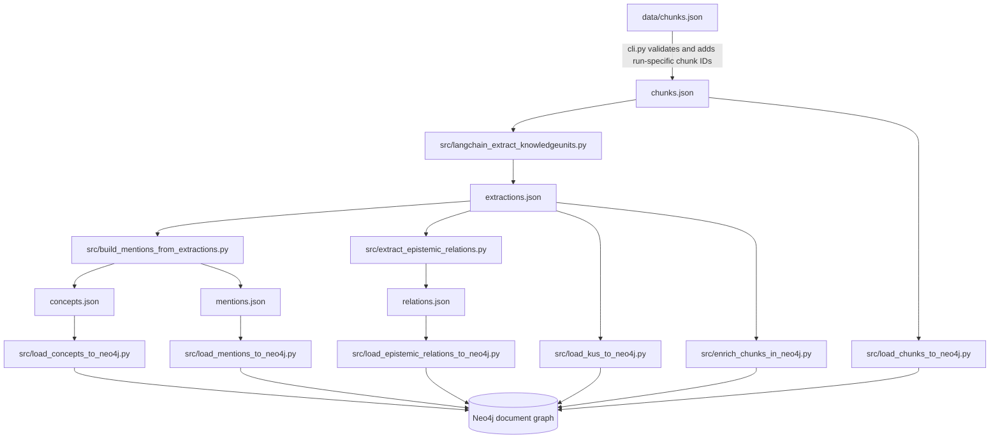
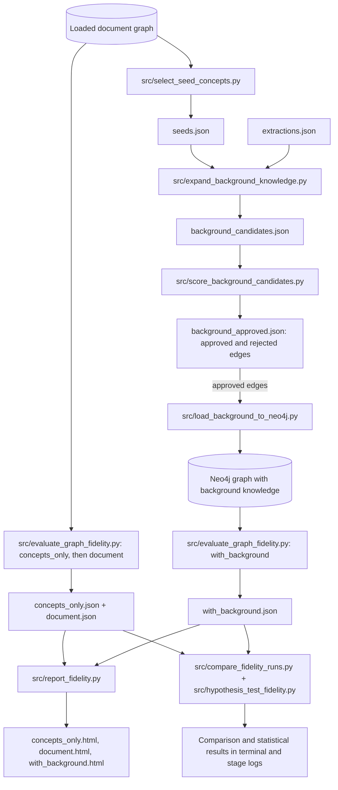
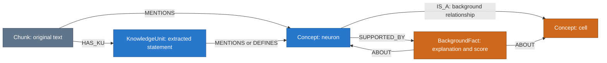

# Project overview

[Back to the run commands and results guide](../README.md)

This page explains the project at a high level, maps the files to the work they
perform, and defines the vocabulary used in the code, graphs, and reports.

An optional [FActScore comparison mode](factscore-comparison.md) now preserves
this pipeline as a baseline, filters background edges against reference evidence,
and compares reconstruction claim precision, coverage, and similarity. It saves
two graph snapshots, an aligned comparison view, and statistical reports. The
default run described below continues to use the existing logic; enable the
comparison with `--factscore` or apply `--compare-factscore RUN_ID` to a saved run.

- [What the project does](#what-the-project-does)
- [How the files work together](#how-the-files-work-together)
- [What is inside the knowledge graph](#what-is-inside-the-knowledge-graph)
- [How evaluation works](#how-evaluation-works)
- [Terminology](#terminology)
- [Where to look in the code](#where-to-look-in-the-code)

## What the project does

The project starts with text that has already been divided into chunks. A local
language model identifies concepts and the roles of the statements in that text.
The pipeline stores those findings as a graph, proposes related background
knowledge, and measures how closely text reconstructed from graph hints matches
the original text.

For example, a chunk might say, “A neuron is an excitable cell.” The document
graph can contain the chunk, its extracted statement, and concepts such as
“neuron” and “excitable cell.” Background expansion can propose additional
relationships around those concepts. The example illustrates the representation;
the exact extractions and proposals depend on the model.

The main outputs are a results page, an interactive HTML graph, and fidelity
reports comparing different sets of reconstruction hints. This is a way to
investigate meaning preservation and enrichment; a high similarity score does
not establish that a generated fact is true.

## How the files work together

The diagrams below describe the default full run. Stage scripts execute
sequentially in the order returned by `build_plan()`. Arrows between files show
calls or data flow, not parallel execution. JSON files are saved inside the
current run's output folder unless another path is shown.

### Entry point, services, and presentation

```mermaid
flowchart TD
    entry["run_pipeline.py"] -->|calls main| cli["pipeline/cli.py"]
    plan["pipeline/plan.py"] -->|returns ordered Step objects| cli
    env[".env"] -->|connection settings| cli
    cli -->|with --start-neo4j| compose["compose.yaml"]
    compose -->|starts container| neo[("Neo4j")]
    cli -->|starts Python subprocesses| scripts["src/ stage scripts"]
    scripts <-->|load and query graph| neo
    scripts <-->|generation and embeddings where needed| ollama["Ollama"]
    scripts -->|write artifacts and reports| files["outputs/runs/run-id/"]
    cli -->|write status and capture stage output| logs["manifest.json + logs/"]
    files -->|read saved graph JSON| graphpy["pipeline/graph_view.py"]
    template["pipeline/graph_view.html"] -->|HTML, CSS, JavaScript template| graphpy
    cli -->|present calls write_graph| graphpy
    graphpy --> graph["knowledge_graph.html"]
    cli -->|present writes| index["index.html + graph.cypher"]
    index -.->|browser link| graph
    index -.->|browser links| reports["HTML reports + Neo4j Browser"]
```

`cli.py` checks dependencies and services before a full run, creates the run
folder, executes the plan, and records progress. The runner passes configuration
to its child processes through environment variables. The stage scripts exchange
saved JSON files and database records rather than passing Python objects between
processes.

### Document extraction and loading



Extraction and relation extraction call Ollama. Building mentions normalizes
concept names, applies aliases, and filters unsuitable concepts without model
calls. The loaders create nodes and relationships. Chunk enrichment adds the
extracted key predicate and anchor phrases used during reconstruction.

### Background knowledge and evaluation



In the default plan, the first two evaluations finish before background expansion
starts. Each evaluation's HTML report is generated immediately after that
evaluation. Expansion and scoring use Ollama, including a critic during scoring.
Reconstruction evaluation uses a generation model and an embedding model.
Report rendering and statistical comparisons do not make model calls.

### New runs versus saved runs

```mermaid
flowchart TD
    cli["pipeline/cli.py"] --> mode{"Selected mode"}
    mode -->|--new| plan["pipeline/plan.py: full plan"]
    plan --> full["Models, Neo4j, saved artifacts, evaluation, results"]
    mode -->|--view-run| saved["pipeline/saved_runs.py: discover and resolve run"]
    saved --> graphonly{"--graph-only?"}
    graphonly -->|yes| graph["pipeline/graph_view.py: saved JSON to HTML"]
    graphonly -->|no| restore["pipeline/saved_runs.py: restore_plan"]
    restore --> reload["Reload Neo4j; render missing reports from saved evaluation JSON"]
    reload --> present["pipeline/cli.py: results page and HTML graph"]
```

The `--graph-only` path needs neither Neo4j nor Ollama. Normal restoration needs
Neo4j but does not repeat extraction or evaluation. Regenerating an HTML graph
updates that file using the current viewer code and the original saved artifacts.

## What is inside the knowledge graph

This simplified example shows node types and relationship directions. It is an
illustration, not a promised model output.



Document relations include `DEFINES`, `PART_OF`, and `CAUSES`. In the current
Neo4j representation these start at a `KnowledgeUnit`; `PART_OF` stores its
child concept in an edge property, and `CAUSES` stores its cause in an edge
property. Adjacent chunks are connected with `NEXT`.

The background loader creates direct concept relationships for `IS_A`,
`HAS_PART`, and `REQUIRES_UNDERSTANDING_OF`. With the default `--with-facts`
loading option, approved rows also receive `BackgroundFact` nodes containing
their explanations and scores. Other approved relation types can appear in the
saved artifacts and HTML view without a corresponding direct Neo4j relationship.

The HTML view presents background facts as concept-to-concept relationships
with supporting details rather than separate fact nodes. It classifies origins
from that run's artifacts. Neo4j is a shared live database: its concepts and
background relationships can be reused across runs, so its current state is not
an isolated historical snapshot.

## How evaluation works

The evaluator asks the generation model to reconstruct a chunk from selected
graph hints. It compares that reconstruction with the original text using word
overlap and embedding similarity.

| Condition | Reconstruction hints |
| --- | --- |
| `concepts_only` | Concepts, key predicate, and anchor phrases; no document-relation or background hints |
| `document` | The above plus document relations selected by the relation policy |
| `with_background` | Document hints plus selected background relationships |

Embedding cosine similarity determines the per-chunk pass/fail result against
the configured threshold. Jaccard word overlap and bag-of-words cosine similarity
provide additional lexical measures. Comparisons summarize the conditions;
paired t-tests and Wilcoxon tests compare matched chunk scores. In the default
full plan, the hypothesis test compares `document` with `with_background`.

Metadata/noise copied verbatim are excluded from hypothesis tests but remain in
report aggregates. These scores measure reconstruction similarity, not factual
correctness or independent verification of the extracted knowledge.

## Terminology

### Text and graph concepts

| Term | Meaning in this project |
| --- | --- |
| Epistemic | Concerning knowledge: what a statement says and its role, such as a definition, example, or causal claim. |
| Chunk | One input text unit with a unique `chunk_id`. You supply the chunk boundaries in JSON. |
| Knowledge unit / statement | A chunk's model-classified knowledge representation. The current loader creates one `KnowledgeUnit` per successful extraction row, retaining the source text. |
| Concept | A named subject such as `neuron`. Multiple chunks or statements can mention the same concept. |
| Node | An item in the graph: a chunk, statement, concept, or background fact. |
| Relationship / edge | A directed connection such as `MENTIONS`, `DEFINES`, or `IS_A`. It can carry properties such as confidence or justification. |
| Mention | A link saying that a chunk or statement refers to a concept; it does not by itself assert a causal or hierarchical relationship. |
| Unit kind | The extraction category: `core_statement`, `definition`, `example`, `metadata`, `navigation`, or `other`. |
| Layer | A model-assigned `core`, `support`, or `scaffolding` category describing the text's role; it is separate from document/background origin. |
| Key predicate | The main verb or relational phrase, such as “propagates along,” retained as a reconstruction hint. |
| Anchor phrase | An exact technical term or formula to preserve during reconstruction rather than paraphrase. |
| Provenance / origin | Where knowledge came from: document extraction or generated background enrichment. In the HTML view, a document concept used in background knowledge is purple. |
| Label versus caption | A Neo4j label groups nodes, such as `Concept`. A caption is the visible text inside a node. Concept names are stored in a property also called `label`, which is distinct from the Neo4j node label. |
| `BackgroundConcept` | A visualization label added by the README's Neo4j command to distinguish background-only concepts. The pipeline does not automatically apply this label. |

### Background enrichment and scores

| Term | Meaning in this project |
| --- | --- |
| Background knowledge | Model-generated additions beyond the document extraction, proposed using seed concepts and source context. It is not retrieved evidence or automatically verified truth. |
| Seed concept | A document concept selected to start expansion, ranked by mentions within the selected run and accompanied by source text. |
| Candidate | A proposed background relationship before approval. |
| Tier | The proposed target's level relative to its seed: parent is more general, sibling is at the same level, child is more specific. |
| Proposer / critic | Model roles: one proposes additions; a later model assessment scores their suitability. They do not necessarily use different models. |
| Analogy coherence | An assessment of whether an analogy-based connection is specific and appropriate to the seed, used as one background scoring dimension. |
| Confidence | An extraction's or proposer's model-supplied score. On loaded background nodes and edges, the `confidence` property instead holds the selected background score. These are not calibrated probabilities. |
| Eigenvalue-weighted score | A weighted combination of domain relevance, hierarchical plausibility, prerequisite value, and analogy coherence. The code derives weights from the leading eigenvector of the score matrix's uncentered `SᵀS`, with fallback weights when needed. |
| Approved / rejected | The scoring pipeline's decision after rule checks and score thresholds. Approved means accepted by these checks, not independently verified. Both sets are saved in `background_approved.json`. |
| Background fact | A Neo4j node storing an approved addition's justification, relationship type, and score, linked to its concepts. The HTML viewer displays those details on relationships. |

### Execution and evaluation

| Term | Meaning in this project |
| --- | --- |
| Run | One pipeline execution with a unique ID and output folder. Chunk IDs are prefixed with that run ID. |
| Stage / step | One script invocation in the ordered plan, such as extraction, loading, or report generation. |
| Artifact | A saved stage output, usually JSON, that another stage or the viewer can reuse. |
| Manifest | `manifest.json`: run settings, status, and per-stage progress recorded by the runner. |
| Preflight | Checks that required dependencies, model services, and the configured database are available before processing. |
| Ollama | The local service used to run the generation and embedding models. |
| Embedding | A numeric representation of text used to calculate semantic similarity between the original and reconstructed text. |
| Neo4j / Cypher | The graph database and its query language. Cypher commands run in Neo4j Browser or through the database driver. |
| GraSS / `:style` | Neo4j Browser's visualization styling mechanism for node captions and colors; independent of the HTML viewer. |
| Fidelity / reconstruction | How closely text generated from graph hints resembles the original chunk. |
| Threshold | A cutoff for a decision. Background approval thresholds and evaluation pass/fail thresholds apply to different scores. |
| Restoration | Reloading saved artifacts into Neo4j and opening results without repeating model extraction or evaluation. |
| Graph-only view | Rendering a saved run's interactive HTML graph without loading Neo4j or calling models. |

## Where to look in the code

| Question | Start here |
| --- | --- |
| Where does execution begin? | [run_pipeline.py](../run_pipeline.py) |
| Where are flags, service checks, logs, and the results page handled? | [pipeline/cli.py](../pipeline/cli.py) |
| What is the exact stage order? | [pipeline/plan.py](../pipeline/plan.py) |
| How are saved runs found and restored? | [pipeline/saved_runs.py](../pipeline/saved_runs.py) |
| How are graph origins and artifact data assembled? | [pipeline/graph_view.py](../pipeline/graph_view.py) |
| Where are graph colors, layout, search, and interactions implemented? | [pipeline/graph_view.html](../pipeline/graph_view.html) |
| What can the extraction model return? | [src/langchain_extract_knowledgeunits.py](../src/langchain_extract_knowledgeunits.py) |
| How are concept names normalized? | [src/build_mentions_from_extractions.py](../src/build_mentions_from_extractions.py) |
| How are background candidates proposed and scored? | [src/expand_background_knowledge.py](../src/expand_background_knowledge.py), [src/score_background_candidates.py](../src/score_background_candidates.py) |
| How is fidelity measured? | [src/evaluate_graph_fidelity.py](../src/evaluate_graph_fidelity.py) |
| How is Neo4j started and configured? | [compose.yaml](../compose.yaml), [.env.example](../.env.example) |
| Where are graph provenance and safe HTML data embedding tested? | [tests/test_graph_view.py](../tests/test_graph_view.py) |

To print the actual default plan without services or model calls, run from the
project folder in PowerShell:

```powershell
& .\.venv\Scripts\python.exe .\run_pipeline.py --dry-run
```

The README remains the command reference; this page explains why those commands
run particular files and how their outputs connect.
